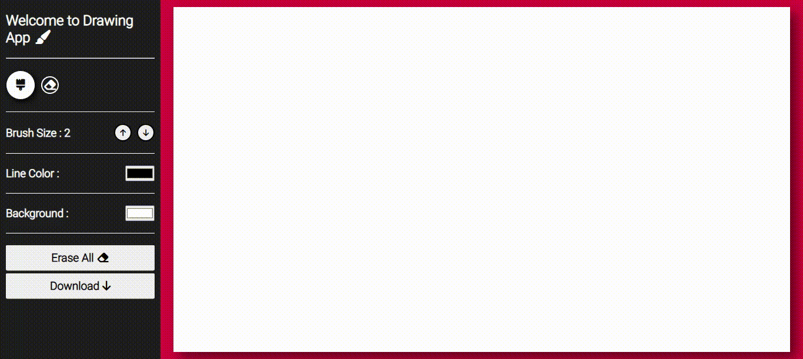

# Canvas Drawing Project

Welcome to the Canvas Drawing project! This GitHub repository hosts a beginner-friendly to intermediate-level web application that allows users to unleash their creativity by drawing on a canvas using HTML, CSS, and JavaScript.

# Overview
The Canvas Drawing project empowers users to express their artistic ideas and create beautiful graphics directly on the canvas. With an intuitive user interface and a wide array of features, both beginners and intermediate-level developers can dive into the world of canvas drawing.

# Technologies Used
The Canvas Drawing project harnesses the power of the following technologies:
<ul>
  <li> HTML: The foundation of the project, responsible for creating the canvas and basic layout structure. </li>
  <li> CSS: Used for styling the user interface and making it visually appealing. </li>
  <li> JavaScript: The backbone of the application, enabling interactive drawing functionalities and handling user input. </li>
</ul>

# Features
Explore a range of exciting features in this canvas drawing application:

## Change Pen Color
With the ability to change the pen colour, users can create vibrant and colourful graphics. Simply select your preferred colour from the colour picker and start drawing!

## Change Background Color
Make your canvas unique by changing its background colour. Experiment with different shades to find the perfect backdrop for your artwork.

## Eraser Pen
Mistakes happen, and that's why this application includes an eraser pen. Easily erase unwanted strokes and refine your artwork with precision.

## Clear Canvas
When you want a clean slate, the "Clear Canvas" feature comes to the rescue. Erase the entire canvas at once, allowing you to start afresh with a blank canvas.

## Download Your Art
Once your masterpiece is complete, you can download it as an image file (e.g., PNG). Share your creations with friends, save them for later, or use them in other projects.

### See for Yourself
<a href="https://ishan2608.github.io/JS-Drawing-App/" target="__blank">Open Site</a>

